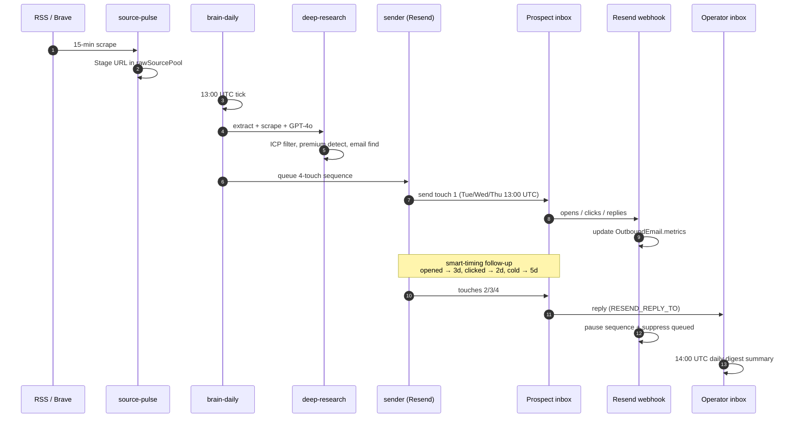

# Brandivibe — System Architecture

A snapshot of the entire Brandivibe stack: public website, AI sales brain,
data persistence, external integrations, and the cron schedule that keeps
it all running.

---

## High-level overview

```mermaid
graph TB
    subgraph "Public website (Next.js / Koyeb)"
        Home["Homepage<br/>+ Hero / Manifesto / Trust Strip<br/>+ Featured Work / Services / Intelligence<br/>+ Process / Contact"]
        Portfolio["/portfolio<br/>(12 demos)"]
        ServicesIdx["/services<br/>+ 5 detail pages"]
        Journal["/journal<br/>+ daily articles (MDX)"]
        AuditForm["/audit<br/>(public form)"]
        AuditPage["/audit/[slug]<br/>(per-prospect personalized)"]
        Dashboard["/dashboard<br/>(admin)"]
    end

    subgraph "API layer (Next.js route handlers)"
        BrainAPI["/api/brain/*<br/>+ run-daily / tick-hourly<br/>+ source-pulse / twitter-intent<br/>+ linkedin-draft / digest<br/>+ senders / experiments<br/>+ webhooks"]
        AuditAPI["/api/audit/run"]
        DashAPI["/api/dashboard/*"]
        ContactAPI["/api/contact"]
    end

    subgraph "Brain logic (lib/brain/)"
        Planner["Planner<br/>(GPT-4o, 10 angles)"]
        Executor["Article executor<br/>(MDX + Pexels)"]
        SourceTick["Source tick<br/>(5 feeds)"]
        Research["Deep research<br/>(scrape + GPT-4o)"]
        EmailFinder["Email finder<br/>(scrape + pattern + MX)"]
        SeqMachine["Sequence machine<br/>(4-touch, smart timing)"]
        Sender["Sender<br/>(multi-account rotation)"]
        Twitter["Twitter intent<br/>(Nitter)"]
        LinkedIn["LinkedIn drafter"]
        Autonomy["Autonomy<br/>(A/B experiments)"]
        Learning["Learning aggregator<br/>(weekly digest)"]
        Health["Health check"]
        DigestEmail["Daily digest email"]
    end

    subgraph "Data layer"
        BrainJson[("brain.json<br/>+ in-memory 30s TTL<br/>+ GitHub-synced")]
        ContentDir[("content/journal/<br/>(MDX articles)")]
        BlastEvents[("data/blast-events.jsonl<br/>(append-only)")]
    end

    subgraph "External services"
        OpenAI["OpenAI<br/>GPT-4o"]
        Resend["Resend<br/>(send + webhooks)"]
        Pexels["Pexels<br/>(hero images)"]
        Brave["Brave Search<br/>(lead-gen dorks)"]
        Nitter["Nitter mirrors<br/>(Twitter scrape)"]
        Feeds["RSS feeds<br/>TC / PH / HN / BetaList"]
        GitHub[("GitHub<br/>Contents API")]
    end

    Home --> BrainAPI
    AuditForm --> AuditAPI
    AuditPage --> BrainJson
    Dashboard --> DashAPI
    Journal --> ContentDir

    BrainAPI --> Planner
    BrainAPI --> Executor
    BrainAPI --> SourceTick
    BrainAPI --> Research
    BrainAPI --> SeqMachine
    BrainAPI --> Sender
    BrainAPI --> Twitter
    BrainAPI --> LinkedIn
    BrainAPI --> Autonomy
    BrainAPI --> Learning
    BrainAPI --> Health
    BrainAPI --> DigestEmail

    Planner --> OpenAI
    Executor --> OpenAI
    Executor --> Pexels
    Executor --> ContentDir
    Research --> OpenAI
    LinkedIn --> OpenAI
    DigestEmail --> Resend
    Sender --> Resend
    SourceTick --> Feeds
    SourceTick --> Brave
    Twitter --> Nitter

    Planner --> BrainJson
    Executor --> BrainJson
    SourceTick --> BrainJson
    Research --> BrainJson
    EmailFinder --> BrainJson
    SeqMachine --> BrainJson
    Sender --> BrainJson
    Twitter --> BrainJson
    LinkedIn --> BrainJson
    Autonomy --> BrainJson
    Learning --> BrainJson

    BrainJson <--> GitHub
    ContentDir <--> GitHub

    Resend -.webhook.-> BrainAPI
```



---

## Cron schedule

```mermaid
gantt
    title GitHub Actions — daily cron schedule (UTC)
    dateFormat HH:mm
    axisFormat %H:%M

    section Continuous
    source-pulse (every 15 min)         :crit, 00:00, 24h
    health-check (every 6 hours)        :00:00, 24h

    section Hourly
    brain-hourly (every hour)           :00:00, 24h

    section Multi-hourly
    twitter-intent (every 2 hours)      :00:30, 24h
    linkedin-draft (every 4 hours)      :00:00, 24h

    section Once daily
    brain-daily                         :13:00, 60m
    daily-digest-email                  :14:00, 30m

    section Weekly
    learning-digest (Mondays)           :14:00, 30m
```



---

## Data flow — prospect lifecycle

How one founder goes from "publicly funded" to "booked call":



---

## Architectural assessment

### Detected pattern

**Modular monolith with cron-driven workers** — a single Next.js
deployment hosting the public website, an admin dashboard, and ~25
API endpoints that double as background-job handlers. GitHub Actions
fires curl requests on a schedule to drive the brain.

### Strengths

| | |
|---|---|
| **Zero database** | All state lives in `brain.json` (JSON file synced to GitHub via Contents API). No Postgres, no migrations, no infra cost. Survives any deploy or restart because the source-of-truth is the repo. |
| **Resumable pipeline** | DailyRun ledger keys phases by date — if Koyeb kills a 300-second function mid-run, the next call picks up at the failed phase. No duplicate GPT spend. |
| **Self-healing** | Health check every 6 hours diagnoses pipeline issues + emails operator. Circuit breaker auto-pauses sender accounts on reputation errors. |
| **Self-learning** | Weekly digest aggregates per-email metrics by 5 dimensions (angle, industry, tier, subject style, sender), proposes A/B tests, and auto-applies winners with 60-day expiry so the brain re-tests. |
| **Multi-source resilience** | Lead radar pulls from 5 feeds via `Promise.allSettled` — one broken feed doesn't kill the tick. |
| **Cost-aware** | Source-pulse stages signals every 15 min with zero GPT cost; expensive extraction is gated to the hourly tick at ~8 articles/run. |

### Risks / structural debt

| Issue | Severity | Mitigation |
|---|---|---|
| `brain.json` is the global writable hot-path. Concurrent writes from multiple cron tasks within the same minute can stomp each other. | **Medium** | Optimistic-concurrency tokens (SHA in GitHub API) currently exist but aren't perfect. A future Postgres or KV upgrade would fix this cleanly. |
| `brain/deep-research.ts` and `brain/blast.ts` are ~565 LOC each (god-modules). Cohesion is OK but they'd be hard for a new engineer to reason about. | **Low-medium** | Each has clear responsibility; split into smaller files when adding new features touches them. |
| Static-export build deletes `src/app/api` and `src/app/dashboard` to satisfy `output: "export"`. The static deploy is therefore feature-incomplete vs. the Koyeb deploy. | **Medium** | Documented in `docs/github-only-migration.md`. Stage B (move brain logic to `.github/scripts/`) closes this gap. |
| All 12 demo pages are bundled into the same Next.js build. R3F + Drei + custom shaders are eagerly imported on routes that don't need them. | **Low** | Each demo's hero is the only WebGL-heavy element; LCP impact is minimal. `next/dynamic` migration would be a 2-3 hour win. |
| `senderAccounts` pool currently has a single primary entry. Scaling to 500 emails/day requires the operator to verify DNS for `m1`–`m9.brandivibe.site` subdomains. | **Operational, not architectural** | Setup doc in `docs/sender-pool-setup.md`. |
| No automated tests. The brain has been hardened over many deploys but a regression in `lead-gen-executor.ts` could silently spam wrong addresses. | **High** | At minimum, a contract test on `pickNextSender()` and a snapshot test on the planner JSON output would catch most regressions. |

### Tech stack

| Layer | Stack |
|---|---|
| Frontend | Next.js 16, React 19, TypeScript, Tailwind, Framer Motion, R3F + Drei + custom GLSL, Lenis |
| Backend | Next.js API routes, Node.js runtime |
| AI | OpenAI GPT-4o (planner / drafter / research) |
| Email | Resend (transactional + webhooks) |
| Image | Pexels CDN |
| Search | Brave Search API |
| Scrape | Native fetch + cheerio-light regex parsing; Nitter mirrors for Twitter |
| State | `brain.json` synced via GitHub Contents API |
| CI / cron | GitHub Actions |
| Hosting | Koyeb (current); GitHub Pages migration scaffolded |

### Recommendations

**Do now (low cost, high value):**

1. **Add a contract test for `pickNextSender()`** — pure function, deterministic given input state. ~30 min to write.
2. **Add a smoke test for the planner output schema** — JSON.parse + Zod validate against `Plan` shape. Catches LLM contract drift.
3. **Wire `next/dynamic` on the 4 most R3F-heavy demo pages** (helix, aurora, orbit, atrium). Cuts homepage LCP by an estimated 200-400ms.

**Do soon (medium cost, compounding value):**

4. **Stage B of the GitHub-only migration**: move brain logic from API routes into `.github/scripts/*.ts`. Eliminates 70% of Koyeb compute and finishes the static-export migration.
5. **Replace `brain.json` with Turso (libSQL)** or Cloudflare D1 for concurrent-write safety. Both have free tiers and SQLite semantics — minimal code change vs. raw JSON-blob writes.
6. **Add Sentry** to the Next.js app + GitHub Actions scripts. Currently errors surface only in workflow logs.

**Do eventually (when complexity warrants):**

7. **Split `deep-research.ts` and `blast.ts`** into focused modules once they exceed ~700 LOC. Right now they're hot-path code with high cohesion — premature.
8. **Per-tenant brain.json** if Brandivibe ever sells the AI brain as a service to other agencies. Multi-tenancy is the only architectural change that requires a real database.

---

## Build → deploy → run

```mermaid
flowchart LR
    Dev[Local dev<br/>npm run dev] -- git push --> GH[GitHub]
    GH -- webhook --> Koyeb[Koyeb<br/>(current production)]
    GH -- workflow --> Pages[GitHub Pages<br/>(static export, scaffolded)]
    GH -- cron --> Actions[GitHub Actions<br/>(brain crons)]
    Actions -- curl x-brain-secret --> Koyeb
    Koyeb -- writes --> GH
    style Pages stroke-dasharray: 5 5
```

The dashed line means "future state" — once Stage B + C of the migration
land, GitHub Actions will run brain logic directly without curling Koyeb,
and GitHub Pages will be the public site.
